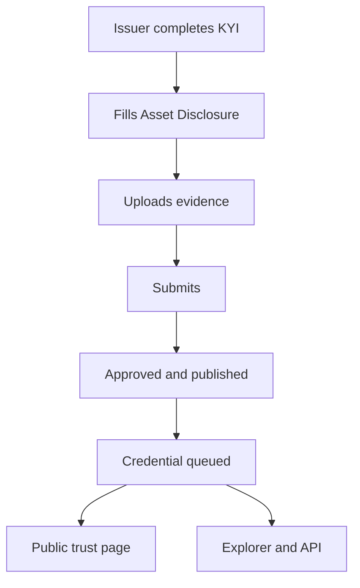

An audit is a point-in-time PDF for one counterparty. Proof of Collateral is published once and read by many: lenders, exchanges, custodians, insurers and supervisors all check the same record. Issuers publish it from [Bluprynt Passport](/passport/proof-of-collateral). Everyone else reads it on the asset's public trust page, in [Compliance Explorer](/explorer/overview) and through the [Public API](/api/public/overview).

## Key concepts

| Term | Meaning |
|---|---|
| **Proof of Collateral** | The issuer's disclosure of what backs an asset, with evidence documents. |
| **Bluprynt Asset Disclosure** | The structured form behind it. The current version is 1.1.0. |
| **AD-Gate** | One of 15 numbered question blocks, each testing one risk, from security classification to revocation triggers. |
| **Template** | A question set for one structure: S1 funds, C1 notes, R1 receivables, M1 real-asset SPVs, L1 structured lending. |
| **Credential** | The attestation Bluprynt queues when the disclosure is submitted. |
| **KYI** | Know Your Issuer. Proof of Collateral is only available for KYI-verified assets. |

## How it works

Submission publishes the disclosure. It's approved on submission and its credential is queued, with no separate review step.

## What it covers

| Layer | Form sections | Evidence |
|---|---|---|
| **Identity** | KYI, Universal Asset Information | The verified issuer and asset facts, carried over from KYI. |
| **Structure** | AD-Gates 1–4: security classification, wrapper type, governing jurisdiction, transfer restrictions | Legal classification and who may hold the asset. |
| **Reserve** | AD-Gate 8 Reserve Portfolio Composition, AD-Gate 13 Reserve Counterparty Concentration | What backs the token and how concentrated it is. |
| **Custody and valuation** | AD-Gate 5 Bankruptcy Remoteness, AD-Gate 6 Independent Custody, AD-Gate 7 Independent Valuation | Who holds the collateral, whether it's ring-fenced and who values it. |
| **Structure-specific terms** | Templates S1, C1, R1, M1, L1 and their upload requests | The documents that apply to the asset's structure. |
| **On-chain risk** | AD-Gates 9–12: rehypothecation, bridges, oracles, admin keys | How the token's on-chain setup could fail. |
| **Controls** | AD-Gate 14 Lawful-Order & Freeze Capability, AD-Gate 15 Continuous Attestation & Revocation Triggers | Freeze powers and what keeps the proof current. |
| **Regional due diligence** | Brazil, CVM Resolution 88/2022, sections BR-A to BR-G | Offer, platform and custody data for Brazilian offerings. |

The form holds 34 file-upload fields for evidence documents.

## Publish or read it

<Steps>
  <Step title="Issuers: start from the asset">
    In Passport, open a KYI-verified asset. Click **Start form** (2) on the **Proof of Collateral** card (1). See [Proof of Collateral in Passport](/passport/proof-of-collateral) for every section.

    <Frame caption="The Proof of Collateral card in Bluprynt Passport.">
      
    </Frame>
  </Step>
  <Step title="Readers: open the public trust page">
    Open `https://verified.bluprynt.com/verified-assets/{address}/{chain}`. The badges at the top (1) show whether the asset has Proof of Collateral. Without one, the page reads **NO PROOF OF COLLATERAL** and the reserve section (5) says no issuer reserve disclosure exists.

    <Frame caption="A public trust page for an asset with no Proof of Collateral yet.">
      
    </Frame>
  </Step>
  <Step title="Readers: check it in Compliance Explorer or by API">
    Search the asset in [Compliance Explorer](/explorer/overview), call the [Public API](/api/public/overview), or embed the [Proof of Collateral badge](/api/public/badge-recipe).
  </Step>
</Steps>

## Reference

### States readers see

| State | Meaning |
|---|---|
| **NO PROOF OF COLLATERAL** | The issuer hasn't submitted a disclosure. |
| Proof of Collateral present | The disclosure is published and its credential is issued or queued. |
| **UNVERIFIED ISSUER** | KYI isn't complete, so Proof of Collateral can't exist yet. |

### Issuer card states

| Card | Meaning |
|---|---|
| **Needs KYI first** | Verify the asset first. |
| **Start form** | No disclosure yet. |
| **Continue form** | Draft in progress. |
| **View form** | Submitted and published. |

## Worked example

A lender is asked to accept a tokenized private-credit token as collateral. They open its public trust page and see the issuer is verified and Proof of Collateral is present. They read the reserve and custody sections, check Template R1's receivables answers, and fetch the same record through the Public API for their risk system. If the page read **NO PROOF OF COLLATERAL**, they would ask the issuer to submit one in Passport first.

## Errors and limits

| Situation | What happens |
|---|---|
| The asset isn't KYI-verified | The issuer sees **Needs KYI first** and can't start the form. |
| The issuer can't read the collateral state | The card still offers **Open form**. |
| A disclosure is submitted | It opens read-only as **View form**. |

## FAQ

<AccordionGroup>
  <Accordion title="Is Proof of Collateral an audit?">
    No. It's the issuer's own structured disclosure with evidence documents. Readers can open the evidence and judge it themselves.
  </Accordion>
  <Accordion title="Who reviews the disclosure?">
    Submission publishes it directly. There's no review step between submit and publish.
  </Accordion>
  <Accordion title="Do readers need an account?">
    No. The public trust page is open to anyone.
  </Accordion>
</AccordionGroup>

## Related pages

- [Proof of Collateral in Passport](/passport/proof-of-collateral)
- [Public trust page](/passport/public-page)
- [Compliance Explorer](/explorer/overview)
- [Proof of Collateral badge](/api/public/badge-recipe)
